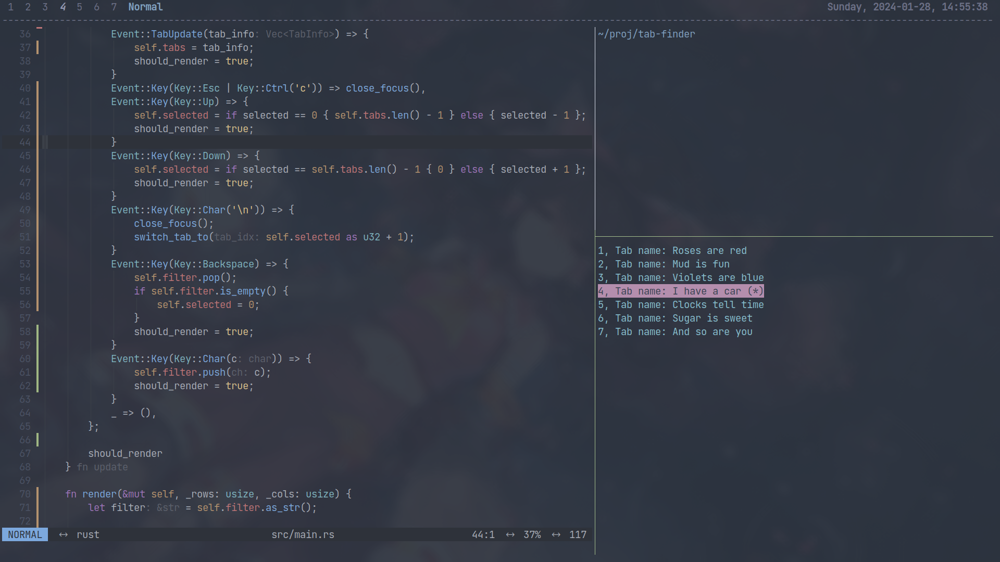
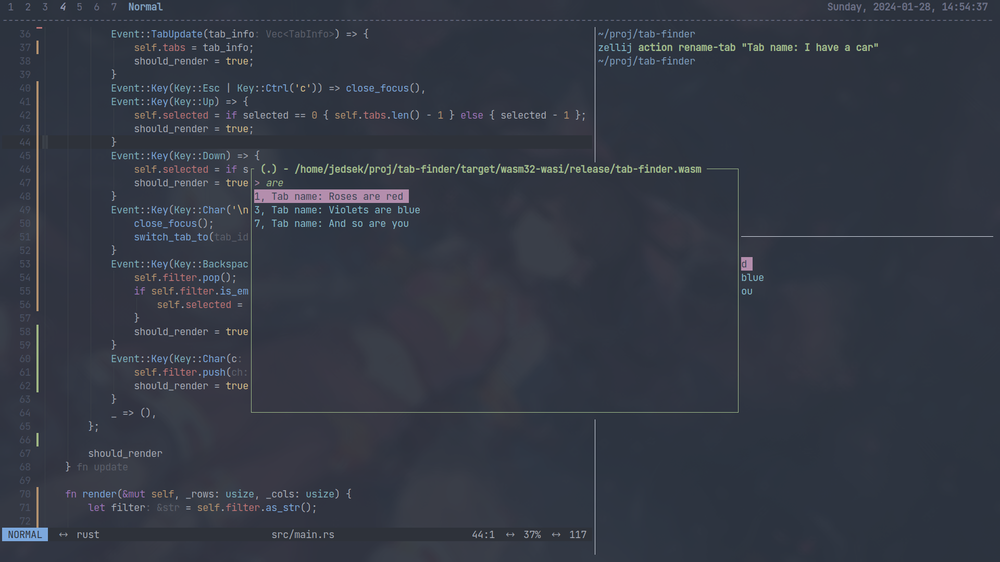

# tab-finder

This is a [zellij](zellij.dev) plugin for quickly switching to specific tab by inputing its name, with beautiful UI.
It based on zellij-tile-`0.39.2`, so should be able to work on `zellij 39.0` or newer

# Show

  
  

# Config

```kdl
// ~/.config/zellij/config.kdl
keybinds {
    // ......
    // ......
    shared_except "locked" {
        bind "Alt t" {
            LaunchOrFocusPlugin "file:~/.config/zellij/plugins/tab-finder.wasm" {
                floating true
                ignore_case true
            }
        }
    }
}
```

# How to get it?

## Release

The precompiled `.wasm` file could be found in [release](https://github.com/Jedsek/tab-finder/releases/)

## Manual

1. `rustup target add wasm32-wasi`
2. `cargo build --release`
3. `cp target/wasm32-wasi/release/tab-finder.wasm ~/.config/zellij/plugins/`


